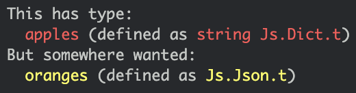
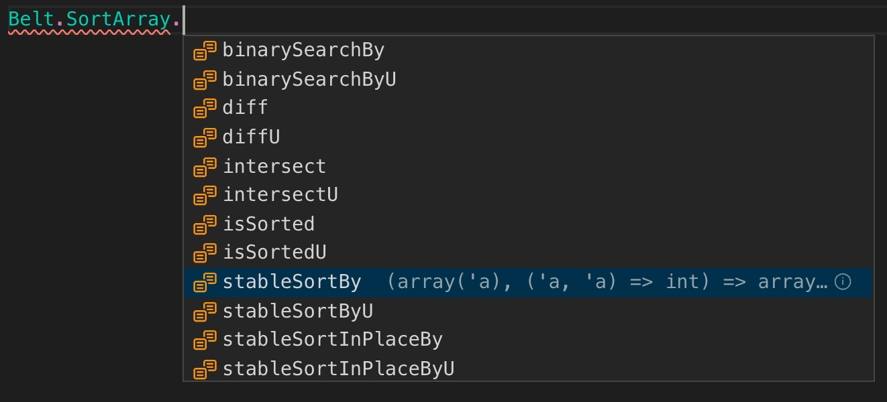

# Reason(React) Best Practices

After using Reason with React for nearly 2 years, I decided to hold a talk about best practices with Reason and ReasonReact at the ReasonML meetup in Vienna (@reasonvienna). Given that it was my first tech talk in a tech meetup, it went pretty well. I published the slides that same day on Twitter, but slides unfortunately do not tell the full story. So I decided to give it a go and put it here in a more descriptive form. I also split it up a bit, as the talk took about one hour and I prefer to keep blog posts short and to the point.

But enough waffling, let's get into it:

## The identity trick

### Zero-cost React.strings!

With Reason being a 100 % type-safe language, there are some peculiarities about writing JSX in Reason which make life for beginners hard, especially when they come from JS and are used to write strings directly into a `<div />` or any other React element which allows children. In Reason, the `React.string` method is needed everywhere where you want to render text in your app, so it makes sense to create a binding for it to a one-letter function.

You could do that by writing

```reasonml
let s = React.string;
```

but you can utilize the compiler to optimize all unnecessary parts away, by using the `external` keyword:

```reasonml
/* Shorter replacement for React.string */
external s: string => React.element = "%identity";
```

To compare the methods, check out this example in the ReasonML playground:
[ReasonML Try - 1](https://reasonml.github.io/en/try?rrjsx=true&reason=LYewJgrgNgpgBAMQJYCcDOAXOBeOBvAKDjlizRzgCUYBDAYwwDpMUkA7AcwG4Ci4BtAAIpaDRnRDAADiDYw2GALp9ScYDQDW8XAAoAlDgB8+PsWIAeMEgBuxvGh0AiZOgyO9AXzjmA9Fdt8HjxBvKCQsHAAyjASbGAUhMQwAB4YMChsNFBwaABcORisnEZUokwwsMDyWLiOAKRIYNVIGACejjzEfEIi9EwS0rLVysSq6loU+iWJZhb+dg6O0bFg7l6+84HBXEA)

as you can see, there is still a function `s` being created in the first example whereas the second one is nowhere to be found. It's probably a very very small runtime improvement, but it gives a good idea of how the Bucklescript compiler works.

In either way, you probably should put the helper function in a utilities module which you can `open` everywhere you need those precious strings in react elements, like so:

```reasonml
open ReactUtils;

[@react.component]
let make = () => {
  <div>
    {s("Hello, dev.to!")}
  </div>
};
```

I named the module `ReactUtils`, because it is specifically meant for working with React elements.

### Keep your codebase free of magic!

Sometimes the type system is just too strict, and in a heterogenous software system there may exist types which are completely the same thing, only with different names. With the `identity` trick you can convert types when they would be actually the same, for instance `Js.Dict.t(string)` and `Js.Json.t`:

```reasonml
type apples = Js.Dict.t(string);
type oranges = Js.Json.t;

let (apples: apples) = Js.Dict.fromArray([|("taste", "sweet")|]);

let eatFruits = (fruit: Js.Json.t) => Js.log2("Eating fruits", fruits);

eatFruits(apples);
```

As you can see, we have apples and oranges here. Both are fruits, as commonly known, but only oranges are actually also defined as `Js.Json.t`. Apples however are defined as `Js.Dict.t(string)` which makes the compiler throw an error.
.

The easiest way to make this code compile is to use `Obj.magic`. It basically switches the type checker off and lets the compiler do his job.

```reasonml
eatFruits(apples->Obj.magic);
```

but it is both more idiomatic (and less risky) to write a conversion function for the two specific types:

```reasonml
external applesToFruits: apples => fruits = "%identity";

eatFruits(apples->applesToFruits);
```

This lets your code compile and still ensures that there is only one distinct type consumed by the function and not _everything_. It still may make sense to use `Obj.magic` sometimes, especially when you just want to create a quick prototype.

## Pipes

### Use the Pipes like Mario!

As many (functional) languages do, also Reason provides us with a special pipe operator (`->`), which essentially flips the code inside out, e.g. `eatFruits(apple)` becomes `apple->eatFruits`. At first it was hard for me to read and comprehend longer pipe chains, but I got used to it after some days of using them. Now they are one of the most indispensable features to me.

- Keeps you from needing to find a name for in-between variables.
- Keeps code tidy.
- Especially useful with `Belt` (Bucklescripts standard library) and its `Option` module which you will encounter very often as we have no `null` or `undefined` here in Reason land.
- When using pipe-first (`->`) with, say `Array.map`it makes the code look pretty similar to Js, e.g.: `[|1, 2, 3|]->Array.map(x => x * 2)` which would be `[1, 2, 3].map(x => x * 2)`.

But just compare the two examples below, first one without using pipes:

```reasonml
let vehicle = Option.flatMap(operationMember.personnelModuleId, id => vehicles->Map.String.get(id));
let vehicleName = Option.mapWithDefault(vehicle, "–", vehicle => vehicle.name)}
s(vehicleName);
```

vs.

```reasonml
member.optionalId
  ->Option.flatMap(id => vehicles->Map.String.get(id))
  ->Option.mapWithDefault({"–", vehicle => vehicle.name)}
  ->s
```

### Pipe parameter position paranoia!

I know there is some war going on between the last-pipers (mostly native Reason and OCaml developers) and the first-pipers (Bucklescript developers), but in Bucklescript, because you have JS as the target language, pipe-first is the way to go. The type inference also works better that way.

If you really want to pipe into a function which is not idiomatic to BS (i.e. the positional parameter is not the first one), you can use the `_` character to substitute where the piped parameter should go:

```reasonml
"ReasonReact"->Js.String.includes("Reason", _);

```

but rather use the pipe-first version of a function preferably, as long as it exists:

```reasonml
"ReasonReact"->Js.String2.includes("Reason");

```

as mentioned earlier.

### Labels to the rescue!

When you have a function like `String.includes` where multiple parameters have the same type, it would be much better to label them directly, otherwise you won't know which of the parameters is the source string, and which one is the search string. Even worse, if you use the wrong pipe (`|>`) and are unsure which parameter it takes, you can get confused easily. And the compiler cannot save you from that case, as the types are totally correct.

Here is a `String.includes` function binding with labels to keep you from guessing which one the positional parameter is:

```reasonml
module BetterString = {
  [@bs.send] external includes : (string, ~searchString: string) => bool = "includes";
};

"ReasonReact"->BetterString.includes(~searchString="Reason");
```

To be fair, we now need to type a bit more, but we gain some doubtlessness and do not have to check MDN to be sure. Also, when you ignore warnings or deactivate the corresponding compiler warning (it's number 6), you could still call the function without labelling the parameter. I would still advise you to not do that, though.

That's all for the first part of _Reason(React) Best Practices_, our next topic will be Bucklescript's compiler configuration. and Belt.

## Lodash equivalents?

Mostly, Belt already got you covered. But it can be hard to find, as the Belt documentation needs to get better.

### Sort arrays?

Against the intuitive guess to look for sort functions like `Belt.Array.sort` which does not exist, there are multiple sorting methods available at
.

To use it, you need to provide a compare function like below:

```reasonml
open Belt;

module User = {
  type t = {
    firstName: string,
    lastName: string,
    id: string,
  };

  let compare = (a: t, b: t) => String.compare(a.lastName, b.lastName);
};

let sortUsers = (users: Map.String.t(user)) =>
  users->Map.String.valuesToArray->SortArray.stableSortBy(User.compare);
}
```

It has to have the same signature as `Pervasives.compare` and return `-1` (or any negative integer) when a < b, `1` (or any positive integer greater than 0) when a > b, and 0 when they are equal.

## Always open your Belt ;-)

```reasonml
open Belt;

let firstNames = Array.map(users => user.firstName);
```

It is a good practice that, when you use Bucklescript's standard library "Belt", you should use it consistently. So either `open Belt` at the top of every file, or if you really want to force your team you can even put

```json
"bsc-flags": ["-open Belt"],
```

to the bsconfig.json of your project which auto-opens Belt for any file in the project.
Why? It shadows some Pervasives (OCaml) modules like Array and List which use a different parameter placement and would not work as well with the fast-pipe.

## JSON

To serialize and deserialize JSON in a type-safe way, we recommend `bs-json` for anything which cannot be automated completely. But since we mostly rely from types coming from the Backend (without any GraphQL), we use atdgen. Our backend devs kindly create JSON schemas from where they can derive their Java classes as well as atdgen can derive ML files. In another conversion step we pipe that through `refmt` now, to automatically generate Reason types for all HTTP request bodies.

## Promises, Futures, async/await

We use our own Promise library now, because none of available ones matched our requirements. (It still needs to be documented though, before we can release it.)

## When to use interface files.

For everything which has library character.

## Bindings

Use bs.obj => to create JS Objects (enums) zero-cost (see reason-react-native)
(also mention bs string). Bindings to react components can be tedious, especially if they are part of a library and you need all the props. (no props spread). Our best practice here ist to use `[@bs.obj]` and `[@bs.string]` because we prefer the zero-cost approach.

```reasonml
type options;

[@bs.obj]
external options:
  (~cancelable: bool=?, ~onDismiss: unit => unit=?, unit) => options =
  "";
```

These are the options we supply to the react-native Alert component. As the `=?` suggests, they are optional (as most react props).

```reasonml
[@bs.scope "Alert"] [@bs.module "react-native"]
external alert:
  (
    ~title: string,
    ~message: string=?,
    ~buttons: array(button)=?,
    ~options: options=?,
    ~type_: [@bs.string] [
              | `default
              | `plainText
              | `secureText
              | `loginPassword
            ]=?,
    unit
  ) => unit = "";
```

Remember that the bs.string js side may need to have unallowed characters, like the `-`. In this case, use [@bs.as]:

```reasonml
// -----snip------
    ~_type: [@bs.string] [
              | `default
              | [@bs.as "plain-text"] `plainText
              | [@bs.as "secure-text"] `secureText
              | [@bs.as "login-password"] `loginPassword
            ]=?
// -----snip------
```

callback arguments still Js.t for easy access.
for more examples skim through the reason-react-native repository which happens to also includes loads of code by us (esp. cknittel).

The contributing guide there also includes a section on zero-cost bindings:
https://github.com/reason-react-native/reason-react-native/blob/master/CONTRIBUTING.md#zero-cost

## Compiler warnings

Compiler warnings: activate warn on polymorphic comparisons (+102) and deactivate
for instance very bad when comparing JsDate which reside in a record - write a comparison function for your data structure.
Note that this is opinionated (as mostly all of this talk) and in your project the defaults (or other warnings) may be a better fit.
Warnings as errors for CI. If you are da real mvp, you could also turn them on in dev mode.

General warning numbers (i.e. also valid in OCaml, scroll down to the -w flag):
https://caml.inria.fr/pub/docs/manual-ocaml/comp.html#sec281

Warning 105: https://bucklescript.github.io/blog/#a-new-warning-number-105

Bucklescript-specific warnings (starting with 100):
https://github.com/BuckleScript/bucklescript/blob/b33c4b719f8ef2c8c0a134997ae3918f337c975e/lib/4.02.3/bspp.ml#L1376

### Make functors, or at least use them.

For instance for logging: ReLogger by cca (https://github.com/cca-io/re-logger)
This is especially useful when you want to use the same Logging Api in a web and a native app.
The logger has a default implementation which you can override.

We just use this statement at the top of every file where we need to log something:

```reasonml
module Log = (val ReLogger.make(__MODULE__));
```

No matter whether web or native.
Functors make it easy to have a default implementation which you can override on demand (kinda OOP).

```reasonml
module NativeLoggerImpl: ReLogger.LoggerImpl = {
  open ReLogger;

  let log = (level: level, msg: string) => {
    RNLogging.(logger->nativeLog(msg, level->levelToJs));

    if (NodeEnv.env === NodeEnv.development) {
      DefaultImpl.log(level, msg);
    };
  };

  let log2 = (level: level, msg: string, obj: 'a) => {
    RNLogging.(logger->nativeLog(fullMessage(msg, obj), level->levelToJs));

    if (NodeEnv.env === NodeEnv.development) {
      DefaultImpl.log2(level, msg, obj);
    };
  };
};

```

Functors can also be found in the Belt standard library, the most prominent example is probably the Set module.
It requires you to use a Module with a comparable function as a parameter. Thankfully, Belt also provides us a MakeComparable Module:

```reasonml
module Permission = {
  [@bs.deriving jsConverter]
  type t = [
    | `admin
    | `dev
    | `cto
    | `intern
  ];

  let cmp = (x: t, y: t) => compare(x, y);
};

module PermissionId = Belt.Id.MakeComparable(Permission);
let permissions = Set.make(~id=(module PermissionId));
```

The important bit here is the `let cmp` line. The compare function is part of the OCaml Pervasives which are open by default.

## More hidden features they don't tell you in the docs

### Range

There is a range operator (only for char, but still):

```reasonml
type symbol =
  | UppercaseLetter
  | LowercaseLetter
  | OtherChar;

let parseChar = (ch: char) => switch(ch) {
  | 'A'..'Z' => UppercaseLetter
  | 'a'..'z' => LowercaseLetter
  | _ => OtherChar
};
```

For lists of int, we can easily define our own operator:

```reasonml
let rec range = (from: int, to_: int) => from > to_ ? [] : [from, ...range(from + 1, to_)];
let (--) = range;

1--7->Js.log();
```

### The fun shorthand

```reasonml
let merge = newItem =>
  fun
  | None => Some([newItem])
  | Some(existingItems) => Some([newItem, ...existingItems]);
```

is a short version for

```reasonml
let merge = (newItem, param) =>
  switch (param) {
  | None => Some([newItem])
  | Some(existingItems) => Some([newItem, ...existingItems])
  };
```

Note that it is pipe-last, though. Also, the lower part is probably easier to understand.
